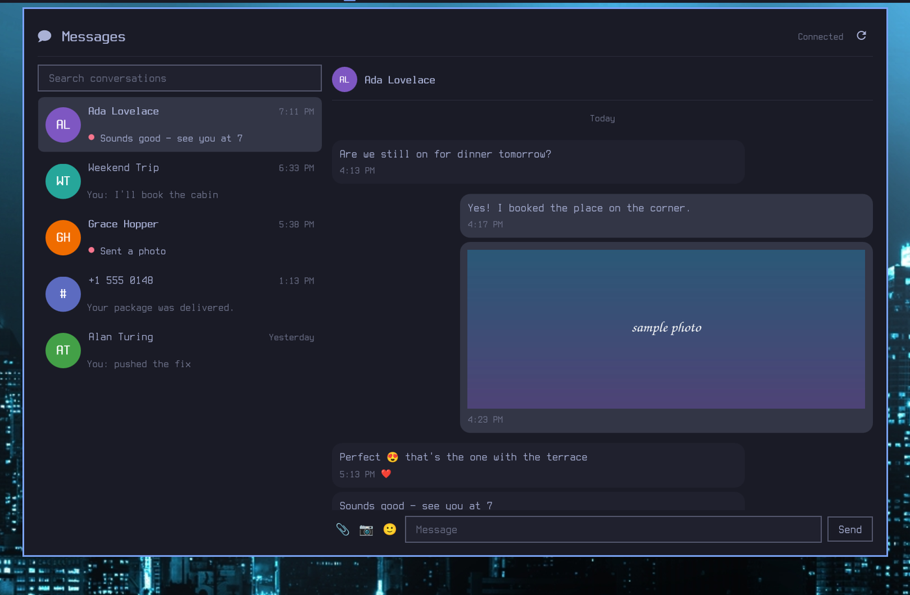

# Google Messages for Omarchy

Read and reply to Google Messages from the Omarchy bar — an unread badge in the
bar, and a panel with your conversation list, full thread history, inline
images, and a composer.

[](https://github.com/MarcFord/gmessages-omarchy-plugin/actions/workflows/ci.yml)



*Screenshot uses synthetic data.*
## Requirements

- Omarchy with the Quickshell shell (`omarchy-shell`)
- An Android phone running Google Messages, reachable on the network
- A Chromium-family browser (Chrome, Chromium, or Brave) signed in to Google
  Messages — this is where pairing credentials come from
- Go 1.27+ to build the daemon

Runtime tools, all of which a typical Omarchy install already has:

| Tool | Used for | Without it |
|------|----------|-----------|
| `sqlite3` | reading the browser cookie database | pairing cannot read cookies |
| `secret-tool` (libsecret) | the browser's cookie encryption key | pairing cannot decrypt cookies |
| `xdg-desktop-portal` | the "attach an image" file chooser | the 📎 button does nothing |
| `ffmpeg` | webcam capture | the 📷 button reports a failure |
| `qrencode` | the legacy QR pairing fallback | only the QR path is affected |

## Install

```bash
git clone https://github.com/MarcFord/gmessages-omarchy-plugin
cd gmessages-omarchy-plugin
make install
systemctl --user enable --now gmessagesd
omarchy plugin enable marcford.gmessages
```

`make install` puts the daemon in `~/.local/bin`, the plugin in
`~/.config/omarchy/plugins/marcford.gmessages/`, and a user unit in
`~/.config/systemd/user/`.

To install as a plugin repo instead:

```bash
omarchy plugin add https://github.com/MarcFord/gmessages-omarchy-plugin.git
```

You still need the daemon built and running — the QML alone does nothing.

## Uninstall

```bash
make uninstall
```

That disables and removes the systemd unit, deletes the daemon binary, and
removes the plugin directory. It deliberately leaves your credentials and
cache in place; remove those too with:

```bash
rm -rf ~/.local/share/gmessages-omarchy ~/.cache/gmessages-omarchy
```

Also revoke the device from your phone under **Messages → ⋮ → Device pairing**.

Nothing outside `~/.config/omarchy/plugins/marcford.gmessages/`,
`~/.local/bin/gmessagesd`, and `~/.config/systemd/user/gmessagesd.service` is
written by the installer. Enabling the widget edits your bar layout, but only
through `omarchy plugin enable`, which is Omarchy's own tooling.

## Pairing

Click the bar icon and press **Pair with Google**. That is the whole flow —
no terminal required.

The daemon finds a browser profile you are signed in to, reads the Google
session cookies from it, and starts pairing. The panel then shows a single
large emoji; Google Messages on your phone shows several, and you tap the one
that matches. It expires after about a minute.

**You must have opened https://messages.google.com/web in that browser at
least once and let it load.** The `OSID` cookie is issued by
messages.google.com itself and is absent until you do — signing in to Google
generally is not enough. If that is the problem the panel says so and names
the profile it looked at.

Newer Google Messages builds have removed the QR scanner entirely, which is
why the account flow is the default. **Use a QR code** remains available for
older phones.

Credentials are written to `~/.local/share/gmessages-omarchy/session.json`
(mode `0600`) and reused on every later start. A session is only written once
pairing actually completes.

### Pairing from a terminal

Equivalent, and useful when the panel cannot start:

```bash
gmessagesd pair --from-browser     # read cookies automatically
gmessagesd pair                    # paste a "Copy as cURL" from devtools
```

To unpair: press **Unpair** in the panel, delete the session file, or revoke
the device from your phone.

## Configuration

Settings live in the bar widget entry in `~/.config/omarchy/shell.json`, and
are editable from **Setup → Plugins**:

| Key           | Default              | Meaning                                     |
|---------------|----------------------|---------------------------------------------|
| `autostart`   | `true`               | Try to start the systemd unit if unreachable |
| `serviceName` | `gmessagesd.service` | Unit to start when `autostart` is on         |

## Files

| Path                                        | Contents                            |
|---------------------------------------------|-------------------------------------|
| `~/.local/share/gmessages-omarchy/session.json` | Pairing credentials — **secret** |
| `~/.local/share/gmessages-omarchy/config.json`  | Preferences: chosen browser profile, GIPHY API key — **secret** |
| `~/.cache/gmessages-omarchy/media/`         | Downloaded attachments              |
| `~/.cache/gmessages-omarchy/webcam-*.jpg`   | Photos taken with the webcam        |
| `$XDG_RUNTIME_DIR/gmessages-omarchy/daemon.sock` | Plugin ↔ daemon socket         |

## Using it

Click the bar icon to open the panel. Pick a conversation on the left, read the
thread on the right, type in the composer and press Enter (or Send).

Message text can be selected with the mouse and copied with Ctrl+C; Ctrl+A
selects the whole message. Right-clicking a bubble copies the entire message
without selecting anything. Either way a brief **Copied** confirmation appears.

A thread opens at its newest message and stays pinned there as messages arrive.
Scrolling up releases the pin so nothing yanks you back mid-read; a ↓ button
appears to return to the bottom.

Three buttons sit left of the message box:

| Button | What it does |
|--------|--------------|
| 📎 | Pick an image from disk, via your desktop's own file chooser |
| 📷 | Open the webcam with a live preview and a shutter button |
| GIF | Search GIPHY and send a GIF |
| 🙂 | Emoji picker — search by name, inserts at the cursor |

Each message carries a faint 🙂 button at its corner; click it and pick a reaction. Tapping the same
emoji again takes it back, a different one switches; your own reaction is
outlined. Only the seven emoji Google Messages supports are offered — anything
else is sent as a custom emoji that not every recipient can render.

### GIFs

The **GIF** button searches GIPHY. An empty search shows what is trending.
Picking one downloads it and stages it like any other attachment, so you still
see it and can add a caption before sending.

**You need your own free GIPHY API key.** The picker prompts for it the first
time and explains what to do rather than failing:

1. Go to [developers.giphy.com](https://developers.giphy.com/) and sign in.
2. **Create an App**, and choose **API** (not SDK).
3. Give it a name — `gmessages-omarchy` is fine — and accept the terms.
4. Copy the **API Key** shown.
5. Click **GIF** in the panel and paste it in.

The key you get is a *beta* key: free, issued instantly, no review, and rate
limited to a level that is ample for personal use. A production key requires
GIPHY to review the app and only matters at real volume.

It is stored in `~/.local/share/gmessages-omarchy/config.json` (mode `0600`),
in plaintext, alongside your pairing credentials. To change or remove it, edit
that file — deleting the `giphyApiKey` line returns the picker to its prompt.

#### Why the key is not bundled

Every user needs their own, and no key ships with this plugin:

- A key committed to a public repository is a leaked key; scrapers find them
  within hours.
- Rate limits are per key, so one shared key would be drained by everyone at
  once.
- The key belongs to whoever registered it, and any user's abuse gets *that*
  account's key revoked, breaking GIFs for all of them.
- GIPHY's terms expect per-app registration.

The smallest rendition that still looks right is sent, since carriers reject
large files, and anything over 8 MB is refused. Downloads are restricted to
`https` URLs on `giphy.com`.

Attachments are staged before they go anywhere: you see the image, can add a
caption, and nothing is sent until you press **Send image**.

The file chooser runs through `xdg-desktop-portal`, so it is the same dialog
the rest of your desktop uses and works correctly under Wayland.

The webcam shoots via a separate `ffmpeg` process after a 3-second countdown.
Because there is no live preview (deliberately — see below), the shot is shown
back at a larger size with three choices: **Retake**, **Cancel**, or **Send
image**, plus an optional caption. Rejected captures are deleted rather than
left in the cache.

Set `cameraDevice` if your webcam is not `/dev/video0`.

The emoji picker reads Omarchy's own catalogue, so the set and its search
keywords match the rest of the desktop.

## Why there is no live camera preview

The first version used QtMultimedia's `Camera` and `VideoOutput`, which do work
in a standalone Quickshell instance. Inside the real Omarchy shell they
segfault:

```
Signal: Segmentation fault (11)
#1  libffmpegmediaplugin.so
```

The Omarchy shell is one process that also owns the bar, notifications, and
**the lock screen**, so a crash in a media backend takes the desktop with it —
the same reason this plugin cannot embed a web view. Capture therefore runs as
a child `ffmpeg` process, where a crash can only kill the child.

The first frames are discarded before the shot, because webcams need a moment
to auto-expose and frame zero is usually black.

## Staying paired

Two credentials keep a session alive, and only one looks after itself:

- **The auth token** refreshes on its own. libgm signs a refresh with the
  stored ECDSA key about an hour before expiry, needing no cookies. This is
  not what goes stale.
- **The Google cookies** do not. Every request is authenticated with a
  `SAPISIDHASH` derived from them, and Google rotates `__Secure-1PSIDTS`
  continuously as you use the browser. A snapshot taken at pairing time drifts
  from the browser's copy until Google rejects the session with
  `SESSION_COOKIE_INVALID` — which retrying cannot fix, because it needs a new
  pairing.

libgm keeps the cookies current by applying the `Set-Cookie` headers Google
returns on every request, and the daemon persists the session every 10 minutes
so that survives a restart.

The daemon deliberately does **not** copy cookies from your browser on a timer.
That was tried and it made things worse: `__Secure-1PSIDTS` is a *rotating*
token, and the browser and the daemon each rotate their own copy. Overwriting
the daemon's freshly-rotated cookie with the browser's hands Google a stale
token, which it answers with `SESSION_COOKIE_INVALID` — killing the session the
sync was meant to preserve.

Reading the browser's cookies is reactive only: on an actual authentication
failure, when our copy is known bad and the browser is the only other source.
If the session is already gone the daemon re-pairs itself, which is usually
silent once your account trusts the device.

The practical consequence: **stay signed in to Google in the browser profile
you paired from.** If you sign out there, the daemon loses its source of fresh
cookies and you will eventually have to pair again.

### Choosing a browser profile

By default the daemon picks the most recently used profile that has a complete
cookie set. That is a guess, and wrong as soon as you keep several Google
accounts in separate profiles.

The pairing screen lists every profile it can see, with whether each is usable
and why not:

```
✓  Chrome / Profile 1     7 cookies — ready
•  Chrome / Default       Signed in to Google, but not to Messages.
•  Chromium / Default     no Google cookies could be read
```

Press **Change** to pin one, or **Choose automatically** to go back to the
default behaviour. The choice is stored in
`~/.local/share/gmessages-omarchy/config.json` and is honoured by the
background cookie sync too, so it keeps working with no panel open.

## Deliberate limits

### Why it works this way

The obvious design — embed `messages.google.com/web` in a web view inside the
bar — is not possible. Omarchy's shell is a single long-running Quickshell
process that also owns the bar, notifications, the OSD, and **the lock
screen**. Quickshell never calls `QtWebEngineQuick::initialize()`, so creating
a `WebEngineView` inside it aborts the whole process:

```
FATAL: Argument list is empty, the program name is not passed to
QCoreApplication. base::CommandLine cannot be properly initialized.
```

That is not a recoverable widget error; it takes the desktop shell down with
it. So this plugin does not embed a browser. Instead:

```
┌──────────────────────┐   NDJSON over    ┌────────────────────────┐
│  Quickshell plugin   │◄──unix socket───►│      gmessagesd        │
│  (bar widget + panel)│                  │  Go daemon, libgm      │
└──────────────────────┘                  └───────────┬────────────┘
                                                      │ Google Messages
                                                      │ web protocol
                                                ┌─────▼─────┐
                                                │ Your phone │
                                                └───────────┘
```

`gmessagesd` speaks the real Google Messages web protocol using
[`libgm`](https://pkg.go.dev/go.mau.fi/mautrix-gmessages/pkg/libgm) from the
mautrix project, and exposes a small JSON API. The QML side is pure UI — it
holds one socket and renders what the daemon pushes.


- **No desktop notifications.** Your phone and any other paired client already
  notify you; a third source is noise. The bar badge is the signal.
- **Images only for outgoing attachments.** Sending pictures (from disk or the
  webcam) works; video and audio are not wired up yet. Incoming media of any
  type still downloads.
- **Inbox only, 50 conversations.** This is a bar popup, not an archive
  browser.

### Caveats worth knowing

- `libgm` is a **reverse-engineered** client. Google can break it without
  notice; when they do, this plugin stops working until libgm is updated.
- Pairing consumes one of your limited *Messages for web* device slots.
- RCS and end-to-end encrypted chats are relayed **through your phone**, which
  must stay online. When the phone is unreachable the panel says so.
- Messages are decrypted on this machine to be displayed. Attachments sit in
  the cache directory until you clear it.

## Development

```bash
make build           # build bin/gmessagesd
make test            # go test ./...
make lint            # go vet + qmllint
./bin/gmessagesd --log-level debug --socket /tmp/gm.sock
```

CI runs `gofmt`, `go vet`, a build, and `go test -race` on every push, plus a
QML syntax check. It cannot do more than that: the interesting behaviour needs
a running Quickshell, a paired phone, and a signed-in browser, none of which
exist on a runner. Treat a green tick as "it compiles and the pure logic
holds", not as "it works".

The wire protocol is defined in [`internal/wire/wire.go`](internal/wire/wire.go).
You can drive the daemon by hand:

```bash
printf '{"id":"1","method":"status"}\n' | socat - UNIX-CONNECT:/tmp/gm.sock
```

QML changes under `~/.config/omarchy/plugins/` hot-reload on save. If a change
does not take, force it with `omarchy-shell shell rescanPlugins`.

## Credits

Protocol work is entirely the [mautrix](https://github.com/mautrix/gmessages)
project's. This repo is a desktop client and an Omarchy plugin around it.

## License

MIT — see [LICENSE](LICENSE).
